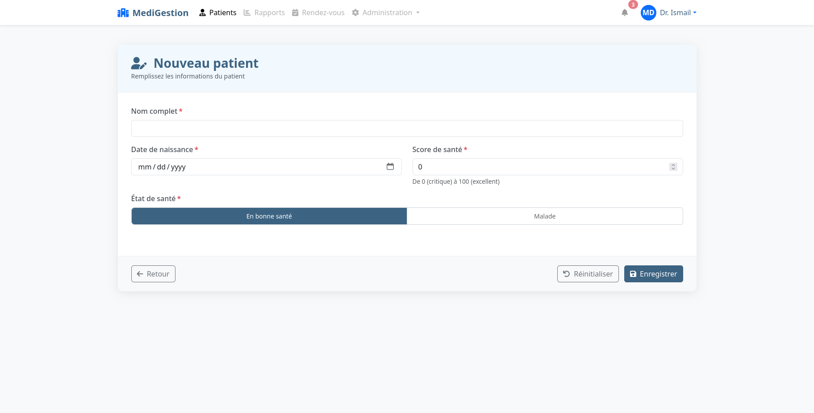
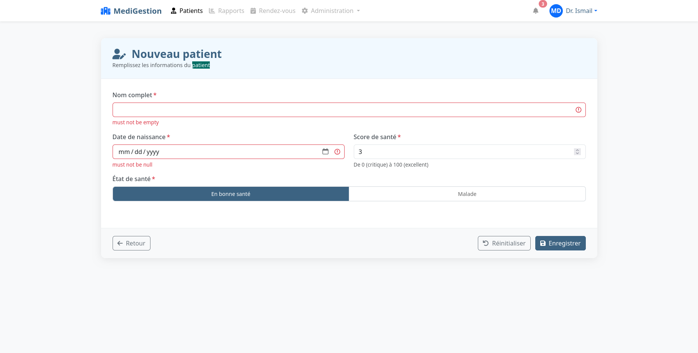

# Application de Gestion des Patients

## Description du Projet

Cette application web JEE basée sur Spring MVC, Thymeleaf et Spring Data JPA permet la gestion des patients d'un établissement médical. Elle offre une interface simple et intuitive pour visualiser les informations des patients.

## Fonctionnalités Implémentées

- ✅ **Affichage des patients** : Les patients sont affichés sous forme de tableau structuré, contenant des informations essentielles telles que leur **ID**, **nom**, **date de naissance**, **état de santé** et **score**. Une barre de recherche et des filtres sont disponibles pour faciliter la navigation et la sélection des patients.
- ✅ **Pagination** : Pour améliorer la navigation et l’expérience utilisateur, le tableau est paginé, permettant d’afficher un nombre limité de patients par page. L’utilisateur peut facilement naviguer entre les pages à l’aide de boutons "Suivant" et "Précédent".
- ✅ **Création des patients** : Un formulaire dédié permet l'ajout de nouveaux patients. Ce formulaire inclut des champs obligatoires pour saisir les informations essentielles du patient. Une validation des données est mise en place afin d’assurer l’intégrité des informations enregistrées. Après soumission, le patient est ajouté à la base de données et visible dans la liste des patients.
- ✅ **Suppression des patients** : Un bouton de suppression est disponible pour chaque patient dans la liste. Lorsqu’un utilisateur souhaite supprimer un patient, une confirmation est demandée afin d’éviter toute suppression accidentelle. Une fois la suppression confirmée, le patient est retiré de la base de données et du tableau d'affichage.


## Captures d'Écran




## Technologies Utilisées
- **Spring MVC** : Architecture Model-View-Controller
- **Spring Data JPA** : Accès simplifié aux données
- **Thymeleaf** : Moteur de template côté serveur
- **Bootstrap 5** : Framework CSS pour l'interface utilisateur
- **Font Awesome** : Bibliothèque d'icônes

## Structure du Projet

```
src/
├── main/
│   ├── java/
│   │   └── com/example/patientapp/
│   │       ├── controllers/
│   │       │   └── PatientController.java
│   │       ├── entities/
│   │       │   └── Patient.java
│   │       ├── repositories/
│   │       │   └── PatientRepository.java
│   │       └── PatientAppApplication.java
│   └── resources/
│       ├── static/
│       ├── templates/
│       │   └── index.html
│       │   └── createPatient.html
│       │   └── template1.html
│       └── application.properties
```

## Comment exécuter l'application

1. Cloner le dépôt Git
2. Configurer la base de données dans `application.properties`
3. Exécuter l'application avec Maven :
   ```
   mvn spring-boot:run
   ```
4. Accéder à l'application via : http://localhost:8080/index
