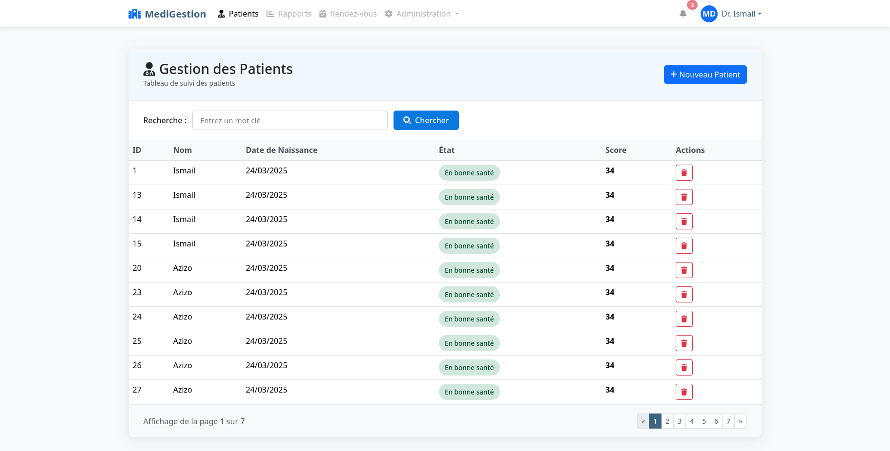

# Application de Gestion des Patients

## Description du Projet

Cette application web JEE basée sur Spring MVC, Thymeleaf et Spring Data JPA permet la gestion des patients d'un établissement médical. Elle offre une interface simple et intuitive pour visualiser les informations des patients.

## Fonctionnalités Implémentées

- ✅ **Affichage des patients** : Visualisation des patients sous forme de tableau avec leurs informations essentielles (ID, nom, date de naissance, état de santé, score)
- ✅ **Pagination** : Navigation simplifiée entre les différentes pages de la liste des patients




## Technologies Utilisées
- **Spring MVC** : Architecture Model-View-Controller
- **Spring Data JPA** : Accès simplifié aux données
- **Thymeleaf** : Moteur de template côté serveur
- **Bootstrap 5** : Framework CSS pour l'interface utilisateur
- **Font Awesome** : Bibliothèque d'icônes

## Structure du Projet

```
src/
├── main/
│   ├── java/
│   │   └── com/example/patientapp/
│   │       ├── controllers/
│   │       │   └── PatientController.java
│   │       ├── entities/
│   │       │   └── Patient.java
│   │       ├── repositories/
│   │       │   └── PatientRepository.java
│   │       └── PatientAppApplication.java
│   └── resources/
│       ├── static/
│       ├── templates/
│       │   └── index.html
│       │   └── createPatient.html
│       │   └── template1.html
│       └── application.properties
```

## Comment exécuter l'application

1. Cloner le dépôt Git
2. Configurer la base de données dans `application.properties`
3. Exécuter l'application avec Maven :
   ```
   mvn spring-boot:run
   ```
4. Accéder à l'application via : http://localhost:8080/index
